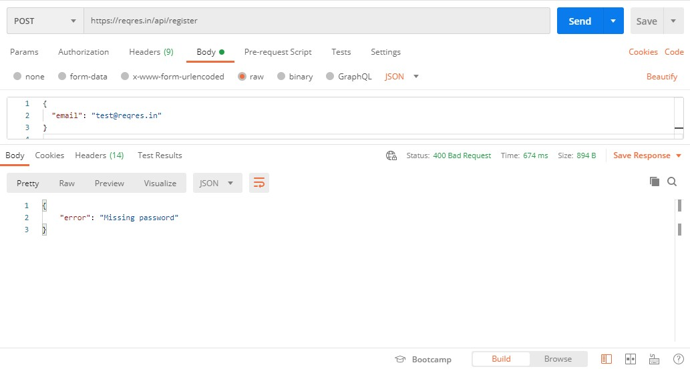

# API Assessment
## API Scenario
1. #### Get User from page 3.
   - Endpoint: GET /api/users?page=3
   - Scenario: Retrieve a list of users from page 3.
   - Expected Result: A successful response with user data from page 3.
   

2. #### Get Single User with ID 10.
   - Endpoint: GET /api/users/10
   - Scenario: Retrieve information for a single user with ID 10.
   - Expected Result: A successful response with the user data for the user with ID 10.
   

  
3. #### Register successful.
   - Endpoint: POST /api/register
   - Scenario: Register a new user with valid information.
   - Payload: Provide valid user registration data in the request body.
   - Expected Result: A successful response indicating that the registration was successful.
   
   
  
4. #### Register failed.
   - Endpoint: POST /api/register
   - Scenario: Attempt to register a new user with invalid information.
   - Payload: Provide invalid or incomplete user registration data in the request body.
   - Expected Result: An error response indicating that the registration failed, possibly with details on the validation errors.
   
